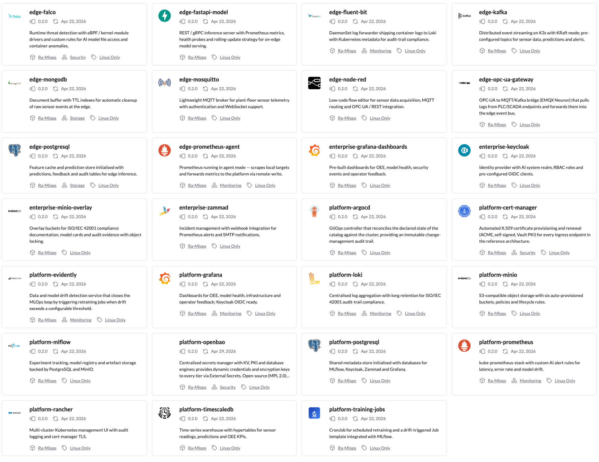

# K3S Solution Catalog for ISO/IEC 42001-Compliant Industrial AI Systems

[](https://opensource.org/licenses/Apache-2.0)
[](https://github.com/CIGIP-UPV/MLOps-ISO42001-K3s-Catalog)
[](https://doi.org/TODO_DOI_ZENODO_AFTER_FIRST_RELEASE)
[](./CITATION.cff)

A structured catalog of K3S-compatible solutions for designing, deploying, and governing AI systems in manufacturing environments in conformity with **ISO/IEC 42001:2023**.

**Repository**: [https://github.com/CIGIP-UPV/MLOps-ISO42001-K3s-Catalog](https://github.com/CIGIP-UPV/MLOps-ISO42001-K3s-Catalog)

This catalog is a companion artifact to the doctoral thesis *Automatización de operaciones en el ciclo de vida de soluciones para fabricación cero defectos* (Mateo-Casalí, Universitat Politècnica de València, 2026).

---

## Overview

The catalog organises solutions along **two dimensions**:

| Dimension | Values |
|-----------|--------|
| **Deployment Tier** | Edge · Platform · Enterprise |
| **Functional Category** | Data Ingestion · AI Inference · Monitoring · Security · Storage · AI Lifecycle · Access Management · Helpdesk · Dashboards |

Every solution entry maps to one or more **ISO/IEC 42001 Annex B requirements** and includes a **deployment questionnaire** to guide configuration decisions before installation.

---

## Architecture Overview

```
┌─────────────────────────────────────────────────────────────┐
│  ENTERPRISE TIER    Keycloak · Zammad · MinIO · Grafana     │
├─────────────────────────────────────────────────────────────┤
│  PLATFORM TIER      Rancher · MLflow · Prometheus · Loki    │
│                     Grafana · MinIO · TimescaleDB           │
├─────────────────────────────────────────────────────────────┤
│  EDGE TIER          Node-RED · FastAPI Model · Fluent Bit   │
│                     Falco · PostgreSQL · Prometheus Agent   │
├─────────────────────────────────────────────────────────────┤
│  DEVICE TIER        Sensors · CNC · IoT · PLCs              │
│                     (outside K3S scope — protocol adapters) │
└─────────────────────────────────────────────────────────────┘
```



All tiers run on **K3S** (lightweight Kubernetes), which is the orchestration layer assumed throughout this catalog. The Platform tier may be managed via **Rancher**.


---

## Installation as a Helm repository

The catalog is published as a Helm chart repository via GitHub Pages. To use it:

```bash
helm repo add zdmp-iso42001 https://cigip-upv.github.io/MLOps-ISO42001-K3s-Catalog/
helm repo update
helm search repo zdmp-iso42001
```

Refer to each solution's individual `README.md` under `catalog/<tier>/<category>/<solution>/` for installation values and ISO/IEC 42001 requirement coverage.

---

## Repository Structure

```
k3s-iso42001-catalog/
├── catalog/
│   ├── edge/                  # Edge tier solutions
│   │   ├── data-ingestion/    # Node-RED, Kafka, Mosquitto
│   │   ├── ai-inference/      # FastAPI model server
│   │   ├── monitoring/        # Fluent Bit, Prometheus Agent
│   │   ├── security/          # Falco
│   │   └── storage/           # PostgreSQL, MongoDB
│   ├── platform/              # Platform tier solutions
│   │   ├── ai-lifecycle/      # MLflow, Training Jobs
│   │   ├── monitoring/        # Prometheus, Grafana, Loki
│   │   ├── data-management/   # MinIO, TimescaleDB, PostgreSQL
│   │   └── orchestration/     # Rancher
│   └── enterprise/            # Enterprise tier solutions
│       ├── access-management/ # Keycloak
│       ├── helpdesk/          # Zammad
│       ├── document-store/    # MinIO
│       └── dashboards/        # Grafana

```

---

## ISO/IEC 42001 Coverage Summary

| Requirement | Keyword | Primary Component(s) |
|-------------|---------|----------------------|
| B.6.1.2.2 | Performance Monitoring | Prometheus, Grafana |
| B.6.1.3.1 | Human Oversight | Keycloak, Grafana Feedback |
| B.6.1.3.2 | Version Control | MLflow |
| B.6.1.3.3 | Usability & Controllability | Grafana, Information Centre |
| B.6.1.3.4 | Release Criteria | MLflow, GitOps |
| B.6.2.3.1 | Architecture Documentation | MinIO (Document Store) |
| B.6.2.5.1 | Deployment Plan | MinIO (Document Store) |
| B.6.2.6.1 | Error Monitoring | Prometheus, Loki |
| B.6.2.6.2 | Technical Performance Monitoring | Prometheus, Grafana |
| B.6.2.6.3 | Goal-oriented Performance Monitoring | Grafana, TimescaleDB |
| B.6.2.6.4 | Retraining Monitoring | Node-RED, MLflow |
| B.6.2.6.5 | Update & Repair Plan | MinIO (Document Store) |
| B.6.2.6.6 | AI Helpdesk | Zammad |
| B.6.2.6.7 | Threat Detection | Falco, Keycloak |
| B.6.2.8.1 | Event Logs | Fluent Bit, Loki |
| B.8.0.2.1 | User Information | Keycloak, Grafana |
| B.8.0.4.1 | Adverse Treatment | Zammad |
| B.8.0.5.1 | Incident Communication | Zammad, Grafana Alerting |

---

## Related Standards

- **ISO/IEC 42001:2023** — AI Management Systems
- **ISO/IEC 42010** — Architecture Description
- **ISA/IEC 62443** — Industrial Cybersecurity
- **EU AI Act** — Risk-based AI regulation
- **ALTAI** — Assessment List for Trustworthy AI

---

## How to cite

If you use this catalog in academic work, please cite the catalog itself and the doctoral thesis it accompanies.

**The catalog (this repository)**

```bibtex
@software{mateo-casali_2026_k3s_catalog,
  author       = {Mateo-Casalí, Miguel Ángel and Boza, Andrés and Fraile, Francisco},
  title        = {K3s Solution Catalog for ISO/IEC 42001-Compliant Industrial AI Systems},
  year         = {2026},
  publisher    = {Zenodo},
  version      = {v1.0.0},
  doi          = {TODO_DOI_ZENODO_AFTER_FIRST_RELEASE},
  url          = {https://github.com/CIGIP-UPV/MLOps-ISO42001-K3s-Catalog}
}
```

**The doctoral thesis**

```bibtex
@phdthesis{mateo-casali_2026_thesis,
  author = {Mateo-Casalí, Miguel Ángel},
  title  = {Automatización de operaciones en el ciclo de vida de soluciones para fabricación cero defectos},
  school = {Universitat Politècnica de València},
  year   = {2026},
  doi    = {TODO_DOI_THESIS_AFTER_DEPOSIT}
}
```

---

## License

This catalog is provided as an open reference resource. See [`LICENSE`](./LICENSE) for details.
