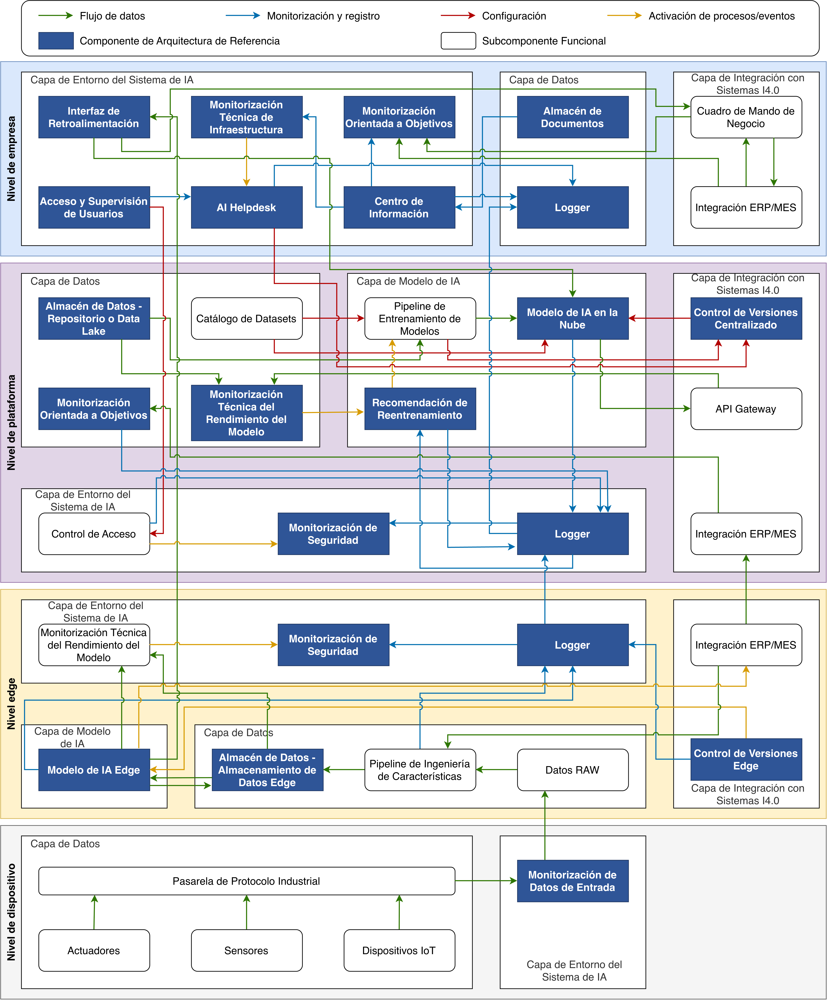

# K3S Solution Catalog for ISO/IEC 42001-Compliant Industrial AI Systems

[](https://opensource.org/licenses/Apache-2.0)
[](https://github.com/CIGIP-UPV/MLOps-ISO42001-K3s-Catalog)
[](https://doi.org/10.5281/zenodo.19882677)
[](./CITATION.cff)

A structured catalog of K3S-compatible solutions for designing, deploying, and governing AI systems in manufacturing environments in conformity with **ISO/IEC 42001:2023**.

**Repository**: [https://github.com/CIGIP-UPV/MLOps-ISO42001-K3s-Catalog](https://github.com/CIGIP-UPV/MLOps-ISO42001-K3s-Catalog)

This catalog is a companion artifact to the doctoral thesis *Automatización de operaciones en el ciclo de vida de soluciones para fabricación cero defectos* (Mateo-Casalí, Universitat Politècnica de València, 2026).

---

## Overview

The catalog organises solutions along **two dimensions**:

| Dimension | Values |
|-----------|--------|
| **Deployment Tier** | Edge · Platform · Enterprise (the Device tier is reached through protocol adapters) |
| **Functional Category** | Data Ingestion · AI Inference · Version Control · AI Lifecycle · Monitoring · Security · Storage · Data Management · Orchestration · Access Management · Helpdesk · Document Store · Dashboards |

Each solution is a Helm chart that K3s can deploy, with a Rancher questionnaire (`questions.yaml`), explicit mappings to the components of the reference architecture (AR-MLOps-ZDM, Annex A of the thesis) and to **ISO/IEC 42001 Annex B** requirements, and traceability labels on every Kubernetes object it creates.

---

## Architecture Overview

The catalog implements the reference architecture AR-MLOps-ZDM (Annex A of the thesis): its components (blue) and functional subcomponents (white) across the device, edge, platform and enterprise tiers, with the data, monitoring and logging, configuration and event flows between them. The labels are in Spanish, as in the thesis.



The catalog provides **31 charts**:

| Tier | Charts |
|------|--------|
| **Edge** (13) | `edge-fastapi-model`, `edge-kafka`, `edge-mosquitto`, `edge-rabbitmq`, `edge-node-red`, `edge-opc-ua-gateway`, `edge-fluent-bit`, `edge-prometheus-agent`, `edge-falco`, `edge-mongodb`, `edge-postgresql`, `edge-postgresql-sync`, `edge-mlflow-sync` |
| **Platform** (13) | `platform-mlflow`, `platform-training-jobs`, `platform-evidently`, `platform-minio`, `platform-postgresql`, `platform-timescaledb`, `platform-grafana`, `platform-loki`, `platform-prometheus`, `platform-rancher`, `platform-argocd`, `platform-openbao`, `platform-cert-manager` |
| **Enterprise** (5) | `enterprise-keycloak`, `enterprise-grafana-dashboards`, `enterprise-minio-overlay`, `enterprise-zammad`, `enterprise-feedback-interface` |

```
+-----------------------------------------------------------------------------+
|  ENTERPRISE  Keycloak · Zammad · document store (MinIO) · dashboards         |
+-----------------------------------------------------------------------------+
|  PLATFORM    MLflow · training jobs · Evidently · Prometheus · Loki · Grafana|
|              MinIO · PostgreSQL · TimescaleDB · Argo CD · OpenBao ·           |
|              cert-manager · Rancher                                          |
+-----------------------------------------------------------------------------+
|  EDGE        OPC UA gateway · Mosquitto · Kafka · RabbitMQ · Node-RED ·      |
|              PostgreSQL · MongoDB · data consolidation · model server ·     |
|              version sync · Prometheus Agent · Fluent Bit · Falco            |
+-----------------------------------------------------------------------------+
|  DEVICE      Sensors · CNC · PLCs (outside K3s, reached over OPC UA / MQTT)  |
+-----------------------------------------------------------------------------+
```


The two data and version flows of the architecture are implemented end to end:

- **Data consolidation** (Data Stock edge to Data Stock platform): `edge-postgresql-sync` pushes the new edge rows to TimescaleDB in idempotent, logged batches.
- **Version propagation** (Version Control platform to Version Control edge): `platform-training-jobs` registers and promotes model versions in MLflow; `edge-mlflow-sync` brings the promoted version to the edge and hot-reloads `edge-fastapi-model`.

All tiers run on **K3s**; the platform may be managed with **Rancher**.

---

## Installation

### Whole catalog (recommended order)

```bash
git clone https://github.com/CIGIP-UPV/MLOps-ISO42001-K3s-Catalog
cd MLOps-ISO42001-K3s-Catalog
kubectl label node <edge-node> node-role.kubernetes.io/edge=true
./infrastructure/install.sh                 # base, security, data, edge, enterprise
./infrastructure/install.sh --help          # phases, --source repo, --only/--skip, ...
```

`install.sh` creates the namespaces and NetworkPolicies, generates the Secrets the charts read (never printed), and installs the charts of this catalog in order with `helm upgrade --install --wait` and the `iso42001` post-renderer. It keeps an existing Rancher and cert-manager untouched, leaves alone the namespaces whose charts are all skipped (`--skip`), and writes one JSON line per release (result, time, ready pods). When only some nodes are edge devices, `--separate-tiers` keeps the platform and enterprise pods off them.

### Individual charts from the Helm repository

```bash
helm repo add cigip-upv https://cigip-upv.github.io/MLOps-ISO42001-K3s-Catalog/
helm repo update
helm search repo cigip-upv
helm install edge-postgresql cigip-upv/edge-postgresql -n edge
```

The repository is built from `main` by the GitHub Pages workflow (`infrastructure/publish.py`: `helm dependency build` from the committed `Chart.lock` files, then `helm package`). Each chart README (`catalog/<tier>/<category>/<solution>/README.md`) lists its namespace, Secrets and configuration.

### Node preparation

`infrastructure/setup-ubuntu.sh` prepares Ubuntu 24.04 nodes (K3s, Helm, Rancher CLI) and enables the Kubernetes API audit log with `infrastructure/audit-policy.yaml`; `infrastructure/enable-audit.sh` does the same on an existing K3s server.

Requirements found in the laboratory validation:

- **NetworkPolicy enforcement.** K3s must run its NetworkPolicy controller (no `disable-network-policy` in the server configuration; restart `k3s-agent` on every agent after changing it), and each node's kernel needs the `hash:ip` ipset type (`CONFIG_IP_SET_HASH_IP`). The NVIDIA JetPack kernel of the laboratory edge device lacks it, so that node does not enforce policies.
- **Falco** uses the `modern_ebpf` driver, which needs a kernel with BTF (`/sys/kernel/btf/vmlinux`).
- **Architecture.** Every edge image is available for amd64 and arm64 except the Bitnami MongoDB image of `edge-mongodb` (amd64 only).

---

## Laboratory Validation

The catalog was validated on a three-node K3s 1.32 cluster (control plane, amd64 worker for the platform and enterprise tiers, and an NVIDIA Jetson AGX Orin as the edge device). The report (in Spanish, for the thesis) and the raw evidence of every run are in [`docs/lab-validation/`](docs/lab-validation/):

- [`INFORME_VALIDACION_LAB.md`](docs/lab-validation/INFORME_VALIDACION_LAB.md) and [`results.json`](docs/lab-validation/results.json): environment, component and deployment tables, smoke, end-to-end, traceability and network results, refinements and limitations;
- [`ADDENDUM_CMP12.md`](docs/lab-validation/ADDENDUM_CMP12.md) and [`results_cmp12.json`](docs/lab-validation/results_cmp12.json): the feedback interface (CMP-12);
- [`run-lab-validation.sh`](docs/lab-validation/run-lab-validation.sh) and [`LAB_RUN_INSTRUCTIONS.md`](docs/lab-validation/LAB_RUN_INSTRUCTIONS.md): the runner that installs the catalog and collects the evidence, to repeat the validation on another cluster.

In short: 27 charts installed with `install.sh` without failures; 18 of 18 applicable smoke tests; 16 of 16 end-to-end steps, from an OPC UA simulator to drift-triggered retraining and the new model version served at the edge; label queries return resources for all 19 ISO/IEC 42001 clauses and 14 of the 15 components (CMP-12 had no chart then); NetworkPolicy segmentation verified on the nodes that enforce it. The [CMP-12 addendum](docs/lab-validation/ADDENDUM_CMP12.md) validates the feedback interface afterwards (all 15 components now have a chart) and documents a fix to the consolidation when the platform node enforces NetworkPolicies.

---

## Repository Structure

```
MLOps-ISO42001-K3s-Catalog/
├── catalog/
│   ├── edge/          data-ingestion/ ai-inference/ version-control/ monitoring/ security/ storage/
│   ├── platform/      ai-lifecycle/ data-management/ monitoring/ orchestration/ security/
│   └── enterprise/    access-management/ helpdesk/ document-store/ dashboards/ human-oversight/
│       └── <solution>/README.md, manifests/{Chart.yaml, Chart.lock, values.yaml, questions.yaml, templates/, files/}
├── infrastructure/
│   ├── 00-namespaces.yaml, 01-network-policies.yaml, 03-network-policies-shared.yaml
│   ├── audit-policy.yaml, setup-ubuntu.sh, enable-audit.sh
│   ├── install.sh                 installer (phases, Secrets, post-renderer, run log)
│   ├── publish.py                 CHART_META (single source of metadata) and Helm repository build
│   ├── verify_charts.py           lint, render, kubeconform, labels, questionnaires, values keys
│   └── iso42001-postrender.py     traceability labels on every rendered object
├── docs/                          GitHub Pages site and Helm repository (index.yaml, icons/)
│   └── lab-validation/            laboratory validation: report, runner, evidence
└── CHANGELOG.md
```

---

## Reference Architecture Coverage

| Component | Name | Charts (tier) |
|-----------|------|---------------|
| CMP-01 | Input Data Monitoring | `edge-kafka` (edge), `edge-mosquitto` (edge), `edge-rabbitmq` (edge), `edge-node-red` (edge), `edge-opc-ua-gateway` (edge) |
| CMP-02 | Data Stock | `edge-mongodb` (edge), `edge-postgresql` (edge), `edge-postgresql-sync` (edge), `platform-minio` (platform), `platform-postgresql` (platform), `platform-timescaledb` (platform) |
| CMP-03 | Version Control | `edge-mlflow-sync` (edge), `platform-mlflow` (platform), `platform-argocd` (platform) |
| CMP-04 | Model | `edge-fastapi-model` (edge), `platform-training-jobs` (platform) |
| CMP-05 | Document Store | `platform-minio` (platform), `enterprise-minio-overlay` (enterprise) |
| CMP-06 | Information Centre | `platform-grafana` (platform), `enterprise-grafana-dashboards` (enterprise) |
| CMP-07 | User Access & Oversight | `platform-openbao` (platform), `enterprise-keycloak` (enterprise) |
| CMP-08 | Infrastructure Technical Monitoring | `edge-prometheus-agent` (edge), `platform-prometheus` (platform) |
| CMP-09 | Logger | `edge-fluent-bit` (edge), `platform-loki` (platform) |
| CMP-10 | Model Technical Performance Monitoring | `edge-fastapi-model` (edge), `edge-prometheus-agent` (edge), `platform-evidently` (platform), `platform-grafana` (platform), `platform-prometheus` (platform) |
| CMP-11 | Goal-Oriented Monitoring | `platform-timescaledb` (platform), `platform-grafana` (platform), `platform-prometheus` (platform), `enterprise-grafana-dashboards` (enterprise) |
| CMP-12 | Feedback Interface | `enterprise-feedback-interface` (enterprise) |
| CMP-13 | AI Helpdesk | `enterprise-zammad` (enterprise) |
| CMP-14 | Retraining Recommendation | `platform-training-jobs` (platform), `platform-evidently` (platform) |
| CMP-15 | Security Monitoring | `edge-falco` (edge), `platform-openbao` (platform), `platform-cert-manager` (platform) |

The Feedback Interface (CMP-12) is `enterprise-feedback-interface`: operators record verdicts on the predictions consolidated in the platform, the training job uses them as labels, and supervisors can suspend the model version in service.

---

## ISO/IEC 42001 Coverage Summary

| Requirement | Label | Charts |
|-------------|-------|--------|
| B.6.1.2.2 | Resources: Monitoring Performance | `edge-prometheus-agent`, `platform-prometheus` |
| B.6.1.3.1 | Resources: Access Control | `edge-mosquitto`, `edge-opc-ua-gateway`, `platform-grafana`, `enterprise-keycloak` |
| B.6.1.3.2 | Resources: Version Control | `edge-mlflow-sync`, `platform-mlflow` |
| B.6.1.3.3 | Resources: Human Oversight / Feedback | `platform-grafana`, `platform-openbao`, `enterprise-grafana-dashboards`, `enterprise-feedback-interface` |
| B.6.1.3.4 | Resources: Inventory / Registry | `platform-mlflow`, `platform-postgresql` |
| B.6.1.4.1 | Resources: Security of AI Assets | `platform-openbao`, `platform-cert-manager` |
| B.6.2.3.1 | Planning: System Documentation | `platform-minio`, `platform-cert-manager`, `enterprise-minio-overlay` |
| B.6.2.5.1 | Planning: Deployment Plan | `platform-minio`, `platform-rancher`, `platform-argocd` |
| B.6.2.6.1 | Operation: Infrastructure Monitoring | `edge-prometheus-agent`, `edge-mongodb`, `edge-postgresql`, `edge-postgresql-sync`, `platform-timescaledb` |
| B.6.2.6.2 | Operation: Model Performance | `edge-fastapi-model`, `platform-evidently`, `platform-grafana`, `platform-prometheus`, `enterprise-grafana-dashboards` |
| B.6.2.6.3 | Operation: KPI Assessment (OEE) | `edge-postgresql`, `platform-timescaledb` |
| B.6.2.6.4 | Operation: Retraining / Lifecycle | `edge-fastapi-model`, `edge-kafka`, `edge-mosquitto`, `edge-rabbitmq`, `edge-node-red`, `edge-opc-ua-gateway`, `edge-mlflow-sync`, `platform-mlflow`, `platform-training-jobs`, `platform-argocd`, `enterprise-feedback-interface` |
| B.6.2.6.5 | Operation: Update & Repair Plan | `enterprise-minio-overlay` |
| B.6.2.6.6 | Operation: Incident Communication | `enterprise-zammad` |
| B.6.2.6.7 | Operation: Security Monitoring | `edge-falco` |
| B.6.2.8.1 | Operation: Logging / Audit Trail | `edge-kafka`, `edge-rabbitmq`, `edge-fluent-bit`, `edge-falco`, `edge-postgresql`, `edge-postgresql-sync`, `edge-mlflow-sync`, `platform-evidently`, `platform-loki`, `platform-argocd` |
| B.8.0.2.1 | Continual Improvement: Roles | `platform-openbao`, `enterprise-keycloak` |
| B.8.0.4.1 | Continual Improvement: Helpdesk | `enterprise-zammad` |
| B.8.0.5.1 | Continual Improvement: Alerts | `platform-evidently`, `platform-prometheus`, `enterprise-zammad` |

Every object created by a chart carries the label `iso42001: "true"` plus one label per clause and component, so the evidence for a requirement can be listed directly from the cluster:

```bash
kubectl get pods,svc,deploy,sts -A -l mlops-iso42001.cigip-upv.es/B.6.2.8.1
kubectl get pods,svc,deploy,sts -A -l mlops-iso42001.cigip-upv.es/CMP-03
```

`infrastructure/verify_charts.py` checks, for every chart, that the rendered objects and pod templates carry these labels.

---

## Related Standards

- **ISO/IEC 42001:2023**: AI management systems
- **ISO/IEC 42010**: architecture description
- **ISA/IEC 62443**: industrial cybersecurity (zones and conduits in `01-network-policies.yaml`)
- **EU AI Act**: risk-based AI regulation
- **ALTAI**: assessment list for trustworthy AI

---

## How to cite

If you use this catalog in academic work, please cite the catalog itself and the doctoral thesis it accompanies.

**The catalog (this repository)**

```bibtex
@software{mateo-casali_2026_k3s_catalog,
  author       = {Mateo-Casalí, Miguel Ángel and Boza, Andrés and Fraile, Francisco},
  title        = {K3s Solution Catalog for ISO/IEC 42001-Compliant Industrial AI Systems},
  year         = {2026},
  publisher    = {Zenodo},
  version      = {v2.0.0},
  doi          = {10.5281/zenodo.19882677},
  url          = {https://github.com/CIGIP-UPV/MLOps-ISO42001-K3s-Catalog}
}
```

**The doctoral thesis**

```bibtex
@phdthesis{mateo-casali_2026_thesis,
  author = {Mateo-Casalí, Miguel Ángel},
  title  = {Automatización de operaciones en el ciclo de vida de soluciones para fabricación cero defectos},
  school = {Universitat Politècnica de València},
  year   = {2026},
  doi    = {TODO_DOI_THESIS_AFTER_DEPOSIT}
}
```

---

## License

This catalog is provided as an open reference resource. See [`LICENSE`](./LICENSE) for details.
